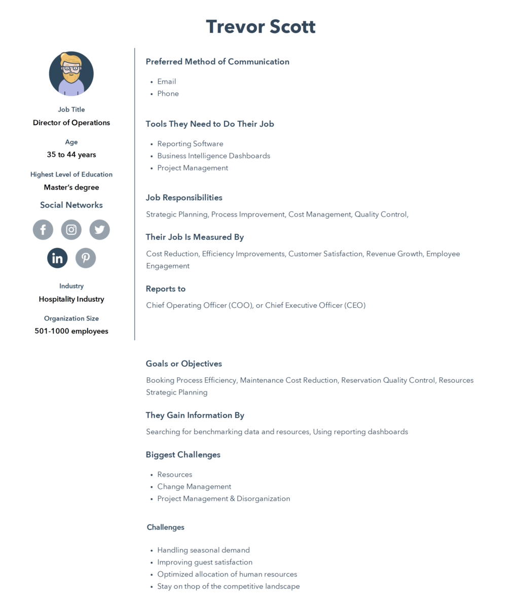

# Proposal for the Shiny Hotel Booking Dashboard

## Motivation and Purpose

The purpose of this visualization dashboard is to present the hotel booking data for exploratory data analysis (EDA) and predictive purposes. The primary objective of the dashboard is to summarize booking information, including the number of bookings, cancellation rates, average booking value, and other important metrics. This allows users to gain a comprehensive understanding of the data to identify significant patterns and trends. The dashboard also serves as a valuable tool for hotel managers and marketers to make informed decisions regarding pricing, promotions, and inventory management. For instance, the dashboard showcases the most popular countries for bookings, the most frequently booked room types, and the periods with the highest booking rates.

### Target Audience and Persona

A buyer persona is a fictional representation of our ideal customer. It's comprised of:

- `Demographic factors`: Age, genders, geographic location, education level
- `Psychographic factors`: What are your buyers' goals and challenges? What motivates them?

Buyer Personas are important because it allows us to provide for PEOPLE, not for COMPANIES.

In this project our role is: **Competitive Insights Platform Provider** and our target audience are **Director of Operations** or **Director of Marketing** at hotel management companies (hospitality industry)

A hypothetical persona of our project is shown below by using [HubSpot Persona Visualizer Tool](https://www.hubspot.com/make-my-persona):

## Description of the Data

### Summary

The data set contains 119390 hotel bookings during the year 2015. Each observation has 32 associated features that describe the hotel type (`hotel`, `country`, `meal`), the reservation details (`arrival_date_month`, `arrival_date_day_of_month`, `adults`, `assigned_room_type`), and the booking method (`distribution_channel`), among others. An initial review of the data indicates it is unbalanced for example categories such as `country` (PRT - 41%) and `distribution_channel` (Travel Agents / Tour Operators - 82%). We may choose to create proportions of bookings relative to each country as to normalize the heatmap. Other than that, no additional variables will be derived for this project.

### Data Dictionary

Since the dataset includes 32 features, the
ones we deemed most important are explained below. This list will be updated if
we decide to use any others.

-   `hotel`: Hotel (H1 = Resort Hotel or H2 = City Hotel)
-   `lead_time`: Number of days that elapsed between booked date and the
    arrival date
-   `stays_in_weekend_nights`: Number of weekend nights (Saturday or
    Sunday) that the guest stayed
-   `adults`: Number of adults
-   `children`: Number of children
-   `babies`: Number of babies
-   `meal`: Type of meal booked
-   `country`: Country of origin
-   `previous_cancellations`: Number of previous bookings that were
    cancelled by the customer prior to the current booking
-   `reserved_room_type`: Code of room type reserved
-   `adr`: Average Daily Rate as defined by dividing the sum of all
    lodging transactions by the total number of staying nights

### Source and Acknowledgements

The data set we are using, `Hotel Booking Demand`, is sourced from [Kaggle](https://www.kaggle.com/datasets/jessemostipak/hotel-booking-demand) by Jesse Mostipak. Originally compiled by Nuno Antonio, Ana Almeida, and Luis Nunes for `Hotel Booking Demand Datasets` in `Data in Brief, Volume 22, February 2019`. Downloaded and cleaned by Thomas Mock and Antoine Bichat for #TidyTuesday during the week of February 11th, 2020.

## Research questions and usage scenario

### Research questions

Imagine you're the Director of Operations at [Fairmont Hotels and Resorts](https://www.fairmont.com/) and you are managing over 70 hotel properties worldwide. Your biggest challenge is resource allocation and pricing given the fact that your industry is affected by the global pandemic. Our app can help you to gain competitive insights over historical booking and pricing data of your hotel and your competitors. Our dashboard answers your questions like:

1.  Which day of the month is the busiest day of booking hotels?
2.  Which countries are the busiest in terms of booking hotels?
3.  What is the total hotel booking number for a specific country in a specific year?
4.  What is the average booking pricing in once specific regions/country?
5.  What is the average time span between booking confirmation and check-in date?

## Usage scenario

As the Director of Operations at Fairmont, Trevor Scott's challenge is to make insightful decisions based on your available business data your competitors data.
In this scenario, Trevor logs into his internal hotel booking dashboard to get an overview of his current bookings. He starts by looking at today's date and then he examines the number of bookings across the globe (our dashboard), which shows a breakdown of bookings and other metrics, based on various countries. He decides to take a look at today's date from last year to get an overview of popular destinations. He wants to see if there is a business opportunity here.

Trevor notices that there was a significant increase in bookings in Germany last year, which prompts him to investigate further. He finds that there was an event that people travelled for, and that bookings in hotels in the region went up. Trevor quickly realises that if he offers a promotion, then the Fairmont will attract more visitors rather than other hotel chains.

Trevor also checks the hotel-wise booking counts from his internal dashboard for those hotels under his management. These plots show a breakdown of the number of bookings per hotel and their average prices. He notices that a few of them are performing poorly this week and that their average price is very high compared to others in his control. He decides to allocate more resources to market those particular hotels to attract more customers.

Overall, the hotel booking dashboard helps Trevor make informed decisions based on real-time data as well as historical data, improving his business performance and customer satisfaction.
