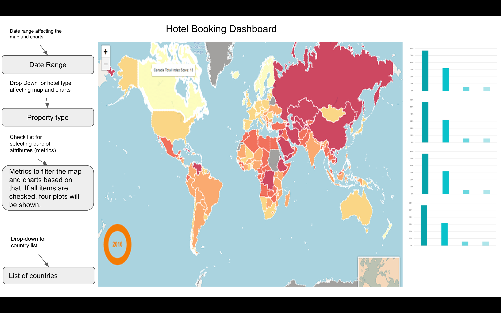

# Hotel Booking Dashboard

Team members: Mengjun Chen, Wilfred Hass, Mohammad Reza Nabizadeh, Roan Raina
## Hotel industry in a glace!
The purpose of this visualization dashboard is to present the hotel booking data for exploratory data analysis (EDA) and predictive purposes. The primary objective of the dashboard is to summarize booking information, including the number of bookings, cancellation rates, average booking value, and other important metrics. This allows users to gain a comprehensive understanding of the data and identify significant patterns and trends. The dashboard also serves as a valuable tool for hotel managers and marketers to make informed decisions regarding pricing, promotions, and inventory management. For instance, the dashboard showcases the most popular countries for bookings, the most frequently booked room types, and the periods with the highest booking rates.

## About the data
The data set presented and used in this project is adopted from [Hotel booking demand](https://www.kaggle.com/datasets/jessemostipak/hotel-booking-demand) data set on Kaggle website. The dataset comprises reservation details for a city hotel and a resort hotel. It contains information about the booking date, duration of the stay, number of adults, children, and babies, available parking spaces, and other related data.
### Data Dictionary
The data dictionary presented below is aiming to make a better understanding of the data. Since the dataset includes 32 features, a set of important features are explained below.
- `hotel`: Hotel (H1 = Resort Hotel or H2 = City Hotel)
- `lead_time`: Number of days that elapsed between booked date and the arrival date
- `stays_in_weekend_nights`: Number of weekend nights (Saturday or Sunday) that the guest stayed
- `adults`: Number of adults
- `children`: Number of children
- `babies`: Number of babies
- `meal`: Type of meal booked.
- `country`: Country of origin.
- `previous_cancellations`: Number of previous bookings that were cancelled by the customer prior to the current booking
- `reserved_room_type`: Code of room type reserved.
- `adr`: Average Daily Rate as defined by dividing the sum of all lodging transactions by the total number of staying nights
## Description of the Dashboard
This dashboard contains three major sections:
- The interactivity control box: This section of the dashboard enables the user to filter the data based on the date, hotel type, etc. to generate their desired plots.
- The map box: This section contains an interactive map that is highlighted based on the user's metric of choice.
- The chart box: This section presents four plots that each of the representing one metric that user has selected to show.

## Sketch

