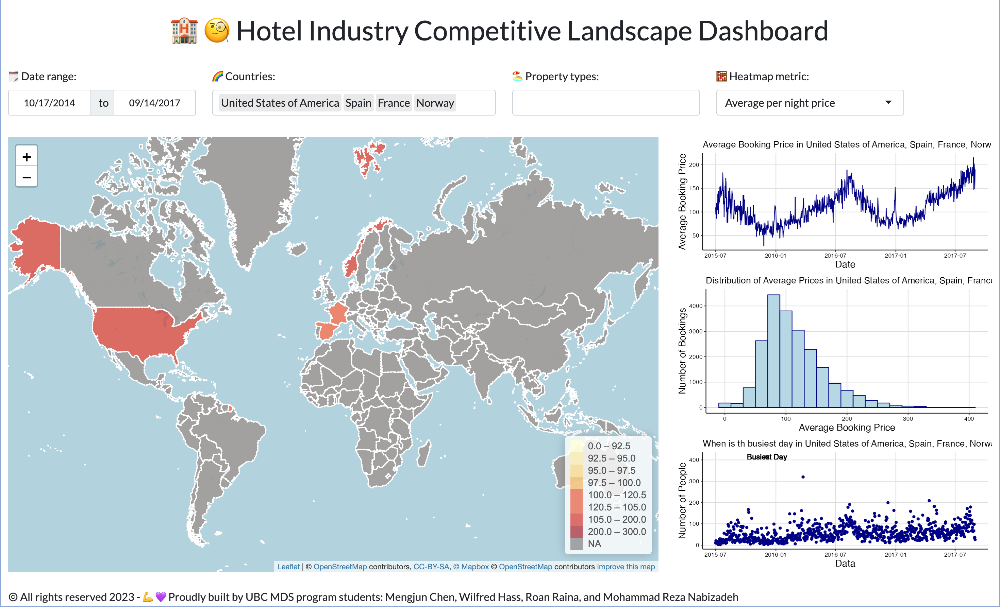

# Hotel Booking Dashboard

<!-- badges: start -->
[](https://github.com/UBC-MDS/shiny_hotel_booking/actions/workflows/deploy-app.yaml)
[](https://github.com/UBC-MDS/shiny_hotel_booking/actions/workflows/testing.yaml)
<!-- badges: end -->

- [Hotel Industry at a Glance](#hotel-industry-at-a-glace)
- [About the Data](#about-the-data)
- [Description of the Dashboard](#description-of-the-dashboard)
- [Contribute](#contribute)
- [How to run app locally](#how-to-run-the-app-locally)
- [Contributors](#contributors)

## Hotel Industry at a Glace!

The purpose of this visualization dashboard is to present the hotel booking data for exploratory data analysis (EDA) and predictive purposes.
The primary objective of the dashboard is to summarize booking information, including the number of bookings, cancellation rates, average booking value, and other important metrics.

This allows prospective travellers to gain a comprehensive understanding of the hotel bookings and identify significant patterns and trends.
Armed with this information, travellers can make better informed decisions about their accomodation when they travel to get the best deal.

The dashboard also serves as a valuable tool for hotel managers and marketers to make informed decisions regarding pricing, promotions, and inventory management. For instance, the dashboard showcases the most popular countries for bookings, the most frequently booked room types, and the periods with the highest booking rates. 

## Use the App

You can access the deployed app on [shinyapps.io here](https://wilfhass.shinyapps.io/shiny_hotel_booking/)!

## About the Data

The data set presented and used in this project is adopted from the
[Hotel booking
demand](https://www.kaggle.com/datasets/jessemostipak/hotel-booking-demand)
data set on the Kaggle website. The data set comprises of reservation
details for a city hotel and a resort hotel. It contains information
about the booking date, duration of the stay, number of adults,
children, and babies, available parking spaces, and other related data.
A more in-depth explanation can be found in [the proposal](Proposal.md).
data dictionary.

## Description of the Dashboard

This dashboard contains three major sections:

-   `The interactivity control box`: This section of the dashboard
    enables the user to filter the data based on a date range, hotel type,
    and country location to generate their desired plots. Furthermore, it 
    allows the user to select the metric that controls the heatmap in the map box.
-   `The map box`: This section contains an interactive map of countries
    that is highlighted based on the user's metric of choice.
-   `The chart box`: This section presents three plots for the given filters.
    One is an average daily price distribution, one is a time-plot of average daily prices and 
    one shows a distribution of the number of booking for each day in the filtered
    range.

The metrics to control the heatmap include things such as the total bookings for 
the selected countries and the average price of bookings in a country. The filters will be in
the form of a date range of bookings, a dropdown list to select the
hotel type and a dropdown list to select multiple countries. Users will
then be able to compare the distributions of the prices and number of bookings in the 
chart box to find a time that best works for them.

For example, one could select a date range of a week in August that they have time off and 
that they're looking to stay in a hotel. Then, they find that Portugal has a low average 
daily price according to the heatmap. They would select Portugal and now they can see the price
distribution as well as how it fluctuates over the week. They can also see if there are lots of 
bookings in Portugal as it might be a super popular place this time of year!




## Contribute!
Interested in contributing? Check out the [Contributing](CONTRIBUTING.md) guidelines. By contributing to this project, you agree to follow the [Code of Conduct](CODE_OF_CONDUCT.md).

There is substantial room to continue development of the project. Currently, we are using only 5 out of 32 columns in the dataset. Help would be appreciated in adding filters for parameters of interest, in addition to generating graphs for other useful metrics. 

## How to run the app locally
To run the app locally, follow the workflow described in [Contributing](CONTRIBUTING.md). Once the repository is cloned, execute the following in terminal (from the top level directory). This will start the shiny app locally and the address will be displayed in the terminal window. 
```bash
Rscript app.R
```

## Contributors
Team members: Wilfred Hass, Mengjun Chen, Mohammad Reza Nabizadeh, Roan
Raina

<a href="https://github.com/UBC-MDS/shiny_hotel_booking/graphs/contributors">
  
</a>
