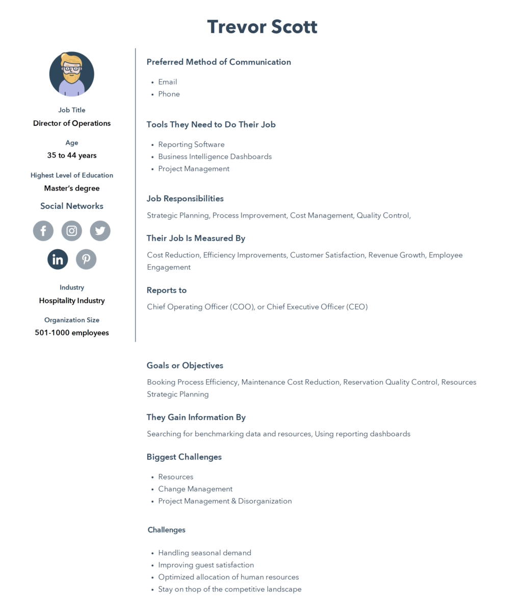

# Proposal for the Shiny Hotel Booking Dashboard

## Motivation and Purpose

The purpose of this visualization dashboard is to present the hotel booking data for exploratory data analysis (EDA) and predictive purposes. The primary objective of the dashboard is to summarize booking information, including the number of bookings, cancellation rates, average booking value, and other important metrics. This allows users to gain a comprehensive understanding of the data to identify significant patterns and trends. The dashboard also serves as a valuable tool for hotel managers and marketers to make informed decisions regarding pricing, promotions, and inventory management. For instance, the dashboard showcases the most popular countries for bookings, the most frequently booked room types, and the periods with the highest booking rates.

### Target Audience and Persona

A buyer persona is a fictional representation of our ideal customer. It's comprised of:

-   `Demographic factors`: Age, genders, geographic location, education level
-   `Psychographic factors`: What are your buyers' goals and challenges? What motivates them?

Buyer Personas are important because it allows us to provide for PEOPLE, not for COMPANIES.

A hypothetical persona of our project is shown below: 

## Description of the Data

### Content

The data set contains 119390 hotel bookings during the year 2015. Each observation has 32 associated features that describe the hotel type (`hotel`, `country`, `meal`), the reservation details (`arrival_date_month`, `arrival_date_day_of_month`, `adults`, `assigned_room_type`), and the booking method (`distribution_channel`), among others. An initial review of the data indicates it is unbalanced for example categories such as `country` (PRT - 41%) and `distribution_channel` (Travel Agents / Tour Operators - 82%). We may choose to create proportions of bookings relative to each country as to normalize the heatmap. Other than that, no additional variables will be derived for this project.

### Source and Acknowledgements

The data set we are using, `Hotel Booking Demand`, is sourced from [Kaggle](https://www.kaggle.com/datasets/jessemostipak/hotel-booking-demand) by Jesse Mostipak. Originally compiled by Nuno Antonio, Ana Almeida, and Luis Nunes for `Hotel Booking Demand Datasets` in `Data in Brief, Volume 22, February 2019`. Downloaded and cleaned by Thomas Mock and Antoine Bichat for #TidyTuesday during the week of February 11th, 2020.

## Research questions and usage scenario

### Research questions

It is always hard to find a good time to visit popular places since hotels are often fully booked. With our dashboard, you will be able to find a good time to book a hotel in your favourite country!

1.  Which day of the month is the busiest day of booking hotels?
2.  Which countries are the busiest in terms of booking hotels?
3.  What is the total hotel booking number for a specific country in a specific year?

## Usage scenario

As a hotel manager in Canada, Trevor Scott logs into the hotel booking dashboard to get an overview of the current bookings for hotels in countries across the world. He starts by looking at this week of last year to see if he can find any popular travelling countries around this time.

Next, he examines the data on the country-wise booking counts, which shows a breakdown of bookings based on different countries. He notices that there was a significant increase in bookings in Germany last year, which prompts him to investigate further. He finds that there was a promotion going on by local German hotels, offering an average daily rate almost 2 times cheaper if the traveler books for a week versus if they book only a few nights. The hotel chain is well known and after investigating the same week for the past few years, it looks like they do the same promotion yearly. To attract similar opportunist getaway enthusiasts this year, Trevor decides to offer a similar promotion here in Canada, thus resulting in an increase in business.

Trevor also checks the hotel-wise booking counts for those hotels under his management. These plots show a breakdown of the number of bookings per hotel and their average prices. He notices that a few of them are performing poorly this week and that their average price is very high compared to others in his control. He decides to apply the promotion for these hotels specifically, increasing the number customers across the hotels in his command.

Overall, the hotel booking dashboard helps Trevor make informed decisions based on real-time data as well as historical data, improving his business performance and customer satisfaction.
